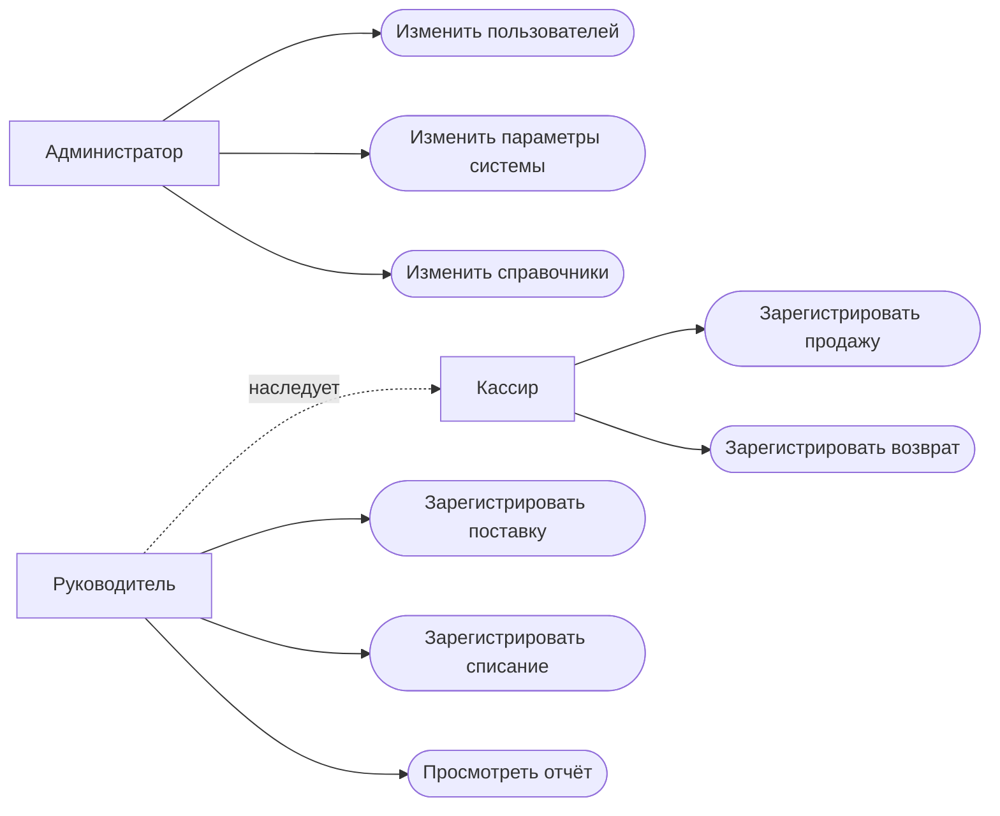

# ЭТАП 0. ТЕХНИЧЕСКОЕ ПРЕДЛОЖЕНИЕ

### Наименование проекта

**Информационная система учета продаж в розничном магазине**

## Цель проекта

Разработка клиент-серверной информационной системы, обеспечивающей:

-   учет продаж товаров
-   учет поступлений от поставщиков
-   управление товарными запасами
-   учет возвратов и списаний
-   формирование аналитической отчетности

Система автоматизирует основные операции розничного магазина и
обеспечивает хранение истории операций.

## Основные задачи проекта

1.  Разработать структуру базы данных для хранения:
    -   товаров
    -   сотрудников
    -   продаж
    -   поставок
    -   возвратов
    -   списаний
2.  Реализовать основные функции системы:
    -   регистрацию продаж
    -   автоматический расчет суммы чека
    -   учет возвратов товаров
    -   учет поступления товаров от поставщиков
    -   автоматическое обновление складских остатков
    -   контроль минимального уровня запасов
    -   регистрацию списаний товаров
3.  Реализовать систему отчетности:
    -   выручка за период
    -   анализ продаж по товарам
    -   анализ продаж по категориям
    -   продажи по сотрудникам
    -   текущие остатки товаров

## Ожидаемые результаты

### Кассир

-   ищет товары
-   оформляет продажи
-   оформляет возвраты

### Руководитель

-   регистрирует поступление товаров
-   выполняет списания товаров
-   получает аналитические отчеты

### Администратор

-   управляет пользователями системы
-   управляет справочниками (товары, категории, поставщики)

## Стек технологий

-   **База данных:** PostgreSQL
-   **Backend:** Java (Spring)
-   **Frontend:** html + css + typeScript (React)
-   **Инструменты:** Git, draw.io

# ЭТАП 1. ИНФОЛОГИЧЕСКОЕ МОДЕЛИРОВАНИЕ

## 1. Описание предметной области

Система предназначена для автоматизации работы розничного магазина.

Она обеспечивает учет: - продаж товаров - поступлений товаров -
возвратов - списаний - складских остатков - аналитической отчетности

Система хранит историю всех операций и позволяет анализировать
деятельность магазина.

## 1.1 Бизнес‑функции системы

### 1. Регистрация и обработка продаж

-   поиск товаров
-   добавление товаров в чек
-   расчет итоговой суммы
-   фиксация сотрудника
-   сохранение продажи
-   уменьшение складских остатков

### 2. Учет поступления товаров

-   регистрация поставки
-   указание поставщика
-   ввод товаров и количества
-   указание закупочной цены
-   увеличение складских остатков

### 3. Управление товарными запасами

-   хранение текущих остатков
-   контроль минимального уровня
-   просмотр остатков товаров

### 4. Формирование отчетности

-   расчет выручки
-   анализ продаж по товарам
-   анализ продаж по категориям
-   анализ продаж по сотрудникам

### 5. Учет возвратов

-   регистрация возврата товара
-   указание причины возврата
-   восстановление складского остатка

### 6. Учет списаний

-   регистрация списания
-   указание причины списания
-   уменьшение остатка товара

## 1.2 Бизнес‑процессы

### Продажа товара

1.  Кассир сканирует или выбирает товары.
2.  Система рассчитывает сумму чека.
3.  Фиксируется сотрудник.
4.  Продажа сохраняется в базе данных.
5.  Складской остаток уменьшается.

### Поступление товара

1.  Руководитель регистрирует поставку.
2.  Указывает поставщика.
3.  Вводит список товаров.
4.  Указывает количество и закупочную цену.
5.  Система сохраняет поставку.
6.  Остатки товаров увеличиваются.

### Возврат товара

1.  Кассир выбирает продажу.
2.  Указывает возвращаемый товар.
3.  Указывает причину возврата.
4.  Система регистрирует возврат.
5.  Остаток увеличивается.

### Списание товара

1.  Руководитель выбирает товар.
2.  Указывает количество.
3.  Указывает причину списания.
4.  Система регистрирует операцию.
5.  Остаток уменьшается.

## 1.3 Роли пользователей

### Кассир

-   поиск товаров
-   оформление продажи
-   оформление возвратов

### Руководитель

-   регистрация поставок
-   регистрация списаний
-   просмотр отчетов

### Администратор

-   управление пользователями
-   управление справочниками

## 1.4 Сущности

1. товар
2. продажа
3. позиция продажи
4. поставка
5. позиция поставки
6. возврат
7. позиция возврата
8. списание
9. позиция списания
10. сотрудник
11. Методы оплаты
12. Статусы продажи
13. единицы измерения
14. причины возвратов
15. причины списаний
16. роли пользователй

## 1.5 Use Case


## 1.6 SQL SCHEMA

```sql

CREATE TABLE units (
    id SERIAL PRIMARY KEY,
    unit VARCHAR(20) NOT NULL
);

CREATE TABLE roles (
    id SERIAL PRIMARY KEY,
    role VARCHAR(50) NOT NULL
);

CREATE TABLE payment_methods (
    id SERIAL PRIMARY KEY,
    payment_method VARCHAR(20) NOT NULL DEFAULT 'CASH'
);

CREATE TABLE statuses (
    id SERIAL PRIMARY KEY,
    status VARCHAR(20) NOT NULL
);


CREATE TABLE productData (
    id SERIAL PRIMARY KEY,
    cost NUMERIC(10,2) CHECK (cost >= 0),
    barcode VARCHAR(20),
    name VARCHAR(50) NOT NULL,
    unit_id INTEGER REFERENCES units(id) NOT NULL,
    minimum INTEGER CHECK (minimum >= 0),
    remains INTEGER CHECK (remains >= 0)
);


CREATE TABLE staff (
    id SERIAL PRIMARY KEY,
    full_name VARCHAR(60) NOT NULL,
    login VARCHAR(60) NOT NULL UNIQUE,
    role_id INTEGER REFERENCES roles(id) NOT NULL,
    password_hash VARCHAR(100) NOT NULL
);


CREATE TABLE saleData (
    id SERIAL PRIMARY KEY,
    date TIMESTAMP NOT NULL DEFAULT CURRENT_TIMESTAMP,
    payment_method INTEGER REFERENCES payment_methods(id) NOT NULL DEFAULT 1,
    status_id INTEGER REFERENCES statuses(id) NOT NULL DEFAULT 1,
    staff_id INTEGER REFERENCES staff(id) NOT NULL
);


CREATE TABLE sales_products(
    product_id INTEGER REFERENCES productData(id),
    sale_id INTEGER REFERENCES saleData(id) ON DELETE CASCADE,
    count NUMERIC(10,3) NOT NULL,
    cost NUMERIC(10,2) CHECK (cost >= 0),
    PRIMARY KEY (sale_id, product_id)
);


CREATE TABLE returns_reasons(
    id SERIAL PRIMARY KEY,
    reason VARCHAR(50)
);


CREATE TABLE returns(
    id SERIAL PRIMARY KEY,
    date TIMESTAMP NOT NULL DEFAULT CURRENT_TIMESTAMP,
    reason_id INTEGER REFERENCES returns_reasons(id),
    staff_id INTEGER REFERENCES staff(id) NOT NULL
);


CREATE TABLE returns_products(
    product_id INTEGER REFERENCES productData(id),
    return_id INTEGER REFERENCES returns(id) ON DELETE CASCADE,
    count NUMERIC(10,3) NOT NULL,
    cost NUMERIC(10,2) CHECK (cost >= 0),
    PRIMARY KEY (return_id, product_id)
);


CREATE TABLE writeoffs_reasons(
      id SERIAL PRIMARY KEY,
      reason VARCHAR(50)
);


CREATE TABLE writeoffs(
    id SERIAL PRIMARY KEY,
    date TIMESTAMP NOT NULL DEFAULT CURRENT_TIMESTAMP,
    reason_id INTEGER REFERENCES writeoffs_reasons(id),
    staff_id INTEGER REFERENCES staff(id) NOT NULL
);


CREATE TABLE writeoffs_products(
    product_id INTEGER REFERENCES productData(id),
    writeoff_id INTEGER REFERENCES writeoffs(id) ON DELETE CASCADE,
    count NUMERIC(10,3) NOT NULL,
    cost NUMERIC(10,2) CHECK (cost >= 0),
    PRIMARY KEY (writeoff_id, product_id)
);


CREATE TABLE shipments(
    id SERIAL PRIMARY KEY,
    date TIMESTAMP NOT NULL DEFAULT CURRENT_TIMESTAMP,
    provider VARCHAR(50),
    staff_id INTEGER REFERENCES staff(id) NOT NULL
);


CREATE TABLE shipments_products(
    product_id INTEGER REFERENCES productData(id),
    shipment_id INTEGER REFERENCES shipments(id) ON DELETE CASCADE,
    count NUMERIC(10,3) NOT NULL,
    cost NUMERIC(10,2) CHECK (cost >= 0),
    PRIMARY KEY (shipment_id, product_id)
);

```


-- https://dbdiagram.io/d/69a461fca3f0aa31e1717c8e
